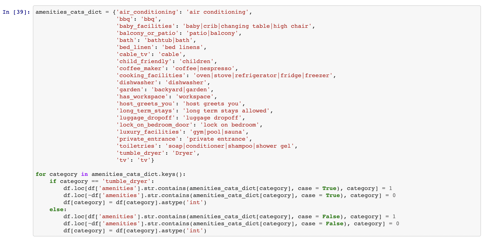
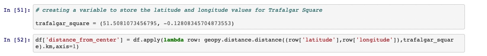
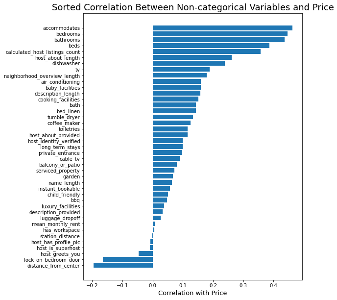
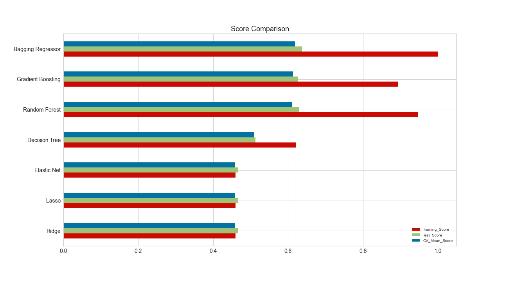
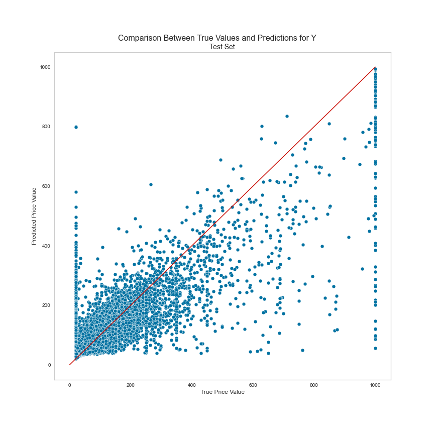

##### General Assembly Data Science Immersive Capstone Project

##### Jimmy Radford - August 2021

# Predicting the Prices of London Airbnb Properties

## Overview

A five-week long personal project on building a machine learning model to predict prices of Airbnb properties in London. The majority of the project was completed as part of a General Assembly London Data Science Immersive course in June 2021, with refinements made in August 2021.

Although the data used for this project is not available in this repository, it can be obtained from its original source at [Inside Airbnb](http://insideairbnb.com/). All code used in the project can be found within the links below.

## Background

Airbnb is a worldwide phenomenon within the hospitality industry, with around 150 million users and seven million listings globally they have become many people's number one choice for where they stay whilst on holiday. Given the huge amounts of data available for Airbnb property listings, I was interested in starting a project to explore this dataset and see what kinds of problems can be solved using it.

## Files in This Repository

[Data Cleaning and Feature Engineering](https://github.com/jradford5/GA_capstone_Airbnb_project/blob/main/capstone_airbnb_1_data_cleaning_feature_engineering.ipynb)

[Exploratory Data Analysis](https://github.com/jradford5/GA_capstone_Airbnb_project/blob/main/capstone_airbnb_2_EDA.ipynb)

[Pre-processing, Modelling and Summary](https://github.com/jradford5/GA_capstone_Airbnb_project/blob/main/capstone_airbnb_3_pp_and_modelling.ipynb)

## Objectives

##### Can we predict the prices of Airbnb properties in London using listings data?

 - The goal of this project was to build a regression model that could predict the prices of Airbnb properties in London using the data available on the listings page of the Airbnb website.

- If successful, it could be used to help new hosts in determining a suitable rental price for new properties.

- As a by-product of this objective, I'm also hoping to analyse the attributes that determine the prices of Airbnb properties.

## Data Acquisition

The data was downloaded in csv format from [Inside Airbnb](http://insideairbnb.com/), an organisation that scrapes data from Airbnb's website for properties all over the world. They provide data for property listings, calendars (the future dates that a property is available for), reviews and geographical data for the neighbourhoods that the properties are based in. For this project, I only required the listings and geographical data.

The listings data contains all information related to each property that can be viewed on the Airbnb website, from the text description the host has written, to whether the property has Wifi or laundry facilities.

Overall, there were 74 different columns in the dataset that corresponded to 73,364 rows for each Airbnb property in London.

## Data Cleaning

To begin with, there were 770,731 null values in the dataset. Some columns were removed completely as they contained too many null values, whereas others had their null values filled in with the column median.

Columns that would not have been useful for modelling (host_picture_url, last_scraped) or were virtual duplicates of other columns (bathrooms, neighbourhood_group_cleansed) were dropped from the dataset.

Several columns had to be amended so that they could be used for modelling purposes. In the example below, I show how I converted the amenities column, containing list values of each property's amenities, into individual binary columns for each important amenity category.

## Feature Engineering

Using the GeoPy library and the latitude and longitude columns within the dataset, I added the following geographical features:

- Nearest train or tube station.
- Distance from the property to the centre of London (Trafalgar Square).
- Distance from the property in km to the nearest station.
- Based on the postcode of the property, the average monthly rental price for a one-bedroom flat.

Length features were also created for all of the text variables to show how many letters each piece of text value.

## EDA

I performed an extensive exploratory data analysis to attempt to understand the data, its distributions and to look for any correlations within the data. I've included an example below of a sorted barplot of the correlation between non-categorical variables and the target variable, but all of the code used and plots created can be found in the [EDA notebook](https://github.com/jradford5/GA_capstone_Airbnb_project/blob/main/capstone_airbnb_2_EDA.ipynb).

## Modelling

#### Feature Selection

Before preparing the dataset, I selected only features that could be extracted from a new property. This meant removing all columns related to reviews, as a new property obviously wouldn't have any.

#### Train-Test Split

The data was separated 80:20 into training and test sets to ensure that the model performed well on unseen data.

#### Pre-processing

The following pre-processing steps were applied to the dataset before I began modelling:

- log transformation (linear regression with regularisation models only)
- one-hot encoding
- standardisation

#### Fitting and Scoring Models

The table below details the regression models that were fitted to the dataset, along with the r2 scores for the training and test sets and the mean 5-fold cross-validation score.

#### Evaluation

The best performing model was a bagging regressor, which achieved a cross-validated R2 score of 0.6187.

Below is a comparison of the predicted prices against the true prices in the test set. As the graph shows, the shape of the fit is slightly cloudy, rather than being tight to the red line, which would indicate accurate predictions. Also, the model had a slight tendency to under-predict the prices of the more expensive properties.

### Key Learnings

- Ensemble models performed much better than the single models, increasing from an R2 score of 0.5085 with a Decision Tree to 0.6187 with a Bagging regressor.
- The model's tendency to under-predict suggests that the features we have aren't enough to accurately predict the target variable.
- In a feature importance analysis of the gradient boosting regressor, the number of properties a host has, how many people a property can accommodate and the number of bathrooms a property has were the most important variables for predicting price.
- Apart from Kensington & Chelsea and Westminster, the borough a property was located in wasn't that useful a predictor.
- The property's distance from the center of London was considered a useful predictor, however.

### Limitations

- Aesthetics aren't taken into account.

A big limitation of this model is that it's not able to determine the luxury quality of a property. If a property has expensive furniture or stylish architecture, then the model wouldn't be able to factor that into its predictions.

- Dataset contains a lot of prices that don't make any sense.

One of the hardest dilemmas I faced was how to deal with properties that had disproportionately low and high advertised prices. A frustration with this dataset is that it doesn't contain the prices that people have actually paid for properties. Unfortunately, the advertised prices are prone to being changed by hosts for motives seemingly other than trying to successfully rent out their property. In the end, I decided that the most appropriate solution was to cap property prices at a lower limit of £20 per night and an upper limit of £1000 per night.

### Conclusions

I've found this to be a really interesting project and a fun dataset to work with, especially when plotting and feature engineering the geographical variables, but the obstacles mentioned above prevent the project from producing a more accurate model.

Although an R2 score of 0.6187 suggests that the model has some predictive power, deeper analysis of the predictions compared with the true values shows that there are instances where the model has missed the true value by some distance. It would be really interesting to find out whether natural language processing or image recognition would be able to improve the model's accuracy in these cases.

### Future Work

- Include natural language processing for the text variables - they might be able to help the model work out whether a property is expensive or not.
- Simplify the project by attempting a classification model to predict price categories rather than actual prices.
- Use neural network models to predict prices.
- Acquire better Airbnb data, either by paying for it or scraping it directly from their website.
- Incorporate image recognition into the project to identify important characteristics in properties' photos.
